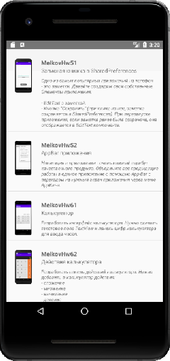

## Список с custom элементами
### Задание:

Возьмите за основу MainActivity из Задания [2.2.2.](https://github.com/netology-code/and-homeworks/tree/master/2.2_viewgroups_sharedpref/2.2.2) или другого задания с приложением. Измените MainActivity, создав список Sample-ов аналогично примеру с лекции.

Добавим в наш список Sample-ов следующие элементы:

- Название Sample-а должно корректно переноситься, если не вмещается на строку.
- Под названием Sample-а, помещаем категорию примера (см. название урока, к которому был задан Sample).
- Справа от названия примера помещаем мини-картинку Sample-а (скриншот экрана этого Sample-а).

